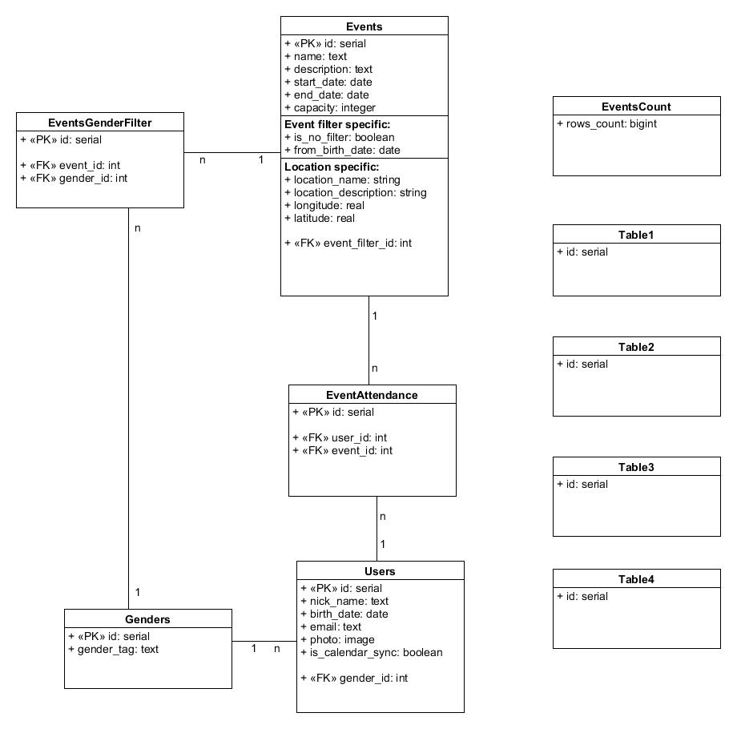

# README

**Scenáre**
1. Scenár: Vytvorenie užívateľského účtu
   - Validácia dát nového usera na serveri, pre dodržanie constraintov
   - Pridávanie záznamu do databázy "users"
2. Scenár: Prihlásenie sa
   - Pomocou e-mailu a passwordu
   - Porovnávanie dát s databázou
3. Scenár: Vytvorenie eventu bez filtrov (pomocou filtrov sa dajú nastaviť kategórie ľudí, ktorým sa event zobrazovať nebude. Zatiaľ jediný filter, ktorý je sprevoznený je filter podľa pohlavia)
   - Validácia dát eventu na serveri, pre dodržanie constraintov
   - Pridávanie záznamu do databázy "events"
4. Scenár: Vytvorenie eventu s filtrami
   - To isté, čo aj v scenári 3
   - Pridávanie záznamov do tabuľky "events_gender_filters" (gender_id, event_id). Ak k danému eventu je v tejto tabuľke záznam, tak užívateľom s daným pohlavím, ktoré je v tomto zázname sa event bude zobrazovať.
5. Scenár: Editovanie eventu
   - Vykoná zmenu záznamu v databáze "events"
6. Scenár: Odstránienie eventu
   - Odstráni všetky záznamy s event_id daného eventu v databáze "events_gender_filters"
   - Odstráni všetky záznamy s event_id daného eventu v databáze "event_attendances"
   - Odstráni daný event z tabuľky eventov
7. Scenár: Pridanie používateľa na event
   - Vytvorí sa záznam v tabuľke event_attendance
8. Scenár: Zobrazenie detailu eventu
   - Vyberie sa konkrétny event z z tabuľky eventov
9. Scenár: Zobrazenie všetkých eventov so stránkovaním
10. Scenár: Zobrazenie všetkých eventov vytvorených prihláseným používateľom so stránkovaním
11. Scenár: Zobrazenie všetkých eventov, na ktoré sa prihlásený používateľ pridal
12. Scenár: Vyhľadanie eventov podľa názvu
    - vyhľadanie podľa presného názvu

**Indexy a optimalizácia**

Najkomplikovanejšie query je práve pri zobrazovaní eventov. (všetko bolo benchmarkované pomocou cost v "EXPLAIN")

Veľa zaberalo hlavne kľúčové slovo "DISTINCT", ktoré nebolo potrebné v danej query.

Ďalej bolo treba optimalizovať joiny, tak som pridal index pre tabuľku "events_gender_filters" na event_id.

Ďalej som pridal index pre tabuľku "event_attendances" na event_id.

Ďalej som pridal index [:created_at desc, :name asc] do tabuľky events kvôli "ORDER BY".

Ďaľšie indexy - user_id v tabuľke "event_attendances", name v tabuľke "events" a author_id v tabuľke "events".

**Optimalizácia získavania počtu eventov**

Získavanie počtu potrebujem pre stránkovanie.

Pri 10mil eventoch je získavanie počtu pomalé (niekedy až 5 sekúnd). Toto som vyriešil pridaním tabuľky, v ktorej je jediný záznam a to na počítanie počtu eventov.
Túto tabuľku aktualizuje trigger, ktorý sa vykonáva pri každom delete/inserte. Kvôli tomuto triggeru je teraz insertovanie/deletovanie pomalšie, ale mohol som túto rýchlosť obetovať, keďže viac sa eventy načítavajú ako vytvárajú/ničia.

**Tranzakcie**

Tranzakcie sú v projekte použité 2.

1. Pri odstraňovaní eventu, kde sa spolu s odstránením eventu odstraňujú aj filtre a attendances (pridania používateľov na event).
2. Pri vytváraní eventu spolu s filtrami.

**Logický model**

**Fyzický model**

<!-- This README would normally document whatever steps are necessary to get the
application up and running.

Things you may want to cover:

* Ruby version

* System dependencies

* Configuration

* Database creation

* Database initialization

* How to run the test suite

* Services (job queues, cache servers, search engines, etc.)

* Deployment instructions

* ... -->
